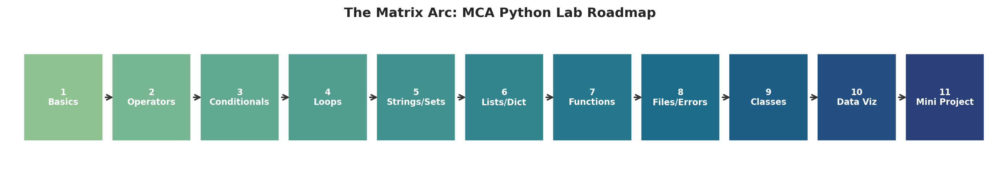
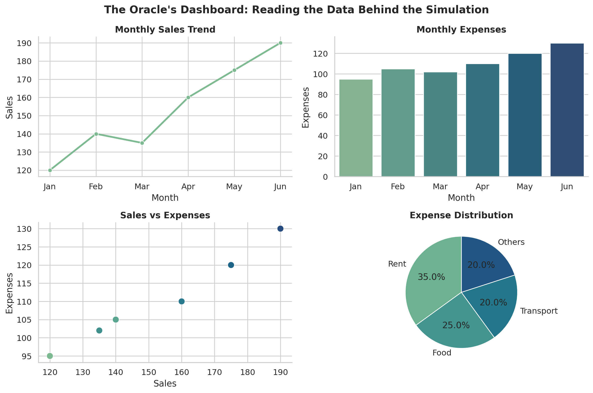
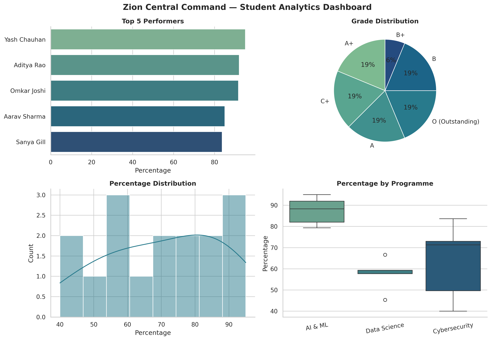

# MCA Python Lab — The Matrix Arc



A complete set of MCA Python laboratory notebooks (Experiments 1–10) plus a capstone mini-project,
all told through a single running narrative: Neo's training from "waking up" to Python basics all
the way to a full data-analytics dashboard. Every notebook is fully executed — code, real output,
diagrams, and formulas — and ready to read straight from GitHub.

## 📖 Overview

Each experiment is one chapter of the arc:

| # | Chapter | Experiment | Key Concepts |
|---|---------|------------|---------------|
| 1 | Waking Up | [Python Installation and Basics](notebooks/Experiment_1_Python_Installation_and_Basics.ipynb) | `print()`, variables, data types |
| 2 | Learning the Laws of the Simulation | [Input Statements and Operators](notebooks/Experiment_2_Input_Statements_and_Operators.ipynb) | Arithmetic, bitwise, membership operators |
| 3 | Choices — The Fork in the Code | [Conditional Statements](notebooks/Experiment_3_Conditional_Statements.ipynb) | `if` / `elif` / `else` |
| 4 | The Training Simulations | [Loops](notebooks/Experiment_4_Loops.ipynb) | `for`, `while`, list comprehensions |
| 5 | Reading the Code Behind the Code | [Strings and Sets](notebooks/Experiment_5_Strings_and_Sets.ipynb) | String methods, set algebra |
| 6 | The Construct's Archives | [Lists, Tuples, Dictionary](notebooks/Experiment_6_Lists_Tuples_Dictionary.ipynb) | Lists, tuples, dictionaries |
| 7 | Agent Subroutines | [Functions](notebooks/Experiment_7_Functions.ipynb) | Functions, recursion, lambdas |
| 8 | Glitches in the Matrix | [File Handling and Exception Handling](notebooks/Experiment_8_File_Handling_and_Exception_Handling.ipynb) | File I/O, custom exceptions |
| 9 | The Architect's Blueprint | [Classes and Objects](notebooks/Experiment_9_Classes_and_Objects.ipynb) | OOP, inheritance, overloading |
| 10 | The Oracle's Data | [Data Analysis and Visualization](notebooks/Experiment_10_Data_Analysis_and_Visualization.ipynb) | NumPy, pandas, Matplotlib/Seaborn |
| 🌟 | Zion Comes Online | [Mini Project: Zion Central Command](mini_project/Mini_Project_Zion_Student_Analytics.ipynb) | Everything above, combined |



## 🗂️ Repository Structure

```
mca-python-lab/
├── README.md
├── requirements.txt
├── notebooks/                 # 10 lab experiment notebooks
│   ├── Experiment_1_Python_Installation_and_Basics.ipynb
│   ├── Experiment_2_Input_Statements_and_Operators.ipynb
│   ├── Experiment_3_Conditional_Statements.ipynb
│   ├── Experiment_4_Loops.ipynb
│   ├── Experiment_5_Strings_and_Sets.ipynb
│   ├── Experiment_6_Lists_Tuples_Dictionary.ipynb
│   ├── Experiment_7_Functions.ipynb
│   ├── Experiment_8_File_Handling_and_Exception_Handling.ipynb
│   ├── Experiment_9_Classes_and_Objects.ipynb
│   └── Experiment_10_Data_Analysis_and_Visualization.ipynb
├── datasets/
│   └── student_records.csv    # used by the mini-project (2 rows intentionally malformed)
├── images/
│   ├── course_roadmap.png
│   ├── experiment10_dashboard_preview.png
│   └── mini_project_dashboard.png
└── mini_project/
    └── Mini_Project_Zion_Student_Analytics.ipynb
```

## 📓 What Every Notebook Includes

Each experiment notebook follows the same consistent structure:

1. **Experiment title** and Matrix-arc chapter framing
2. **Aim / Objective** for the experiment
3. **Python concepts used** (bulleted)
4. **Problem statement** for every question, quoted from the original lab manual
5. **Explanation** of the approach, plus a Mermaid.js workflow diagram and LaTeX formula where relevant
6. **Python code**, with meaningful variable/function names
7. **Sample input and output** — every cell has already been executed, so real output (including charts) is visible directly under the code, no need to re-run anything
8. **Markdown explanations** between every code cell
9. **One original extension** per notebook — a genuinely new problem that builds on (not copied from) the assigned questions
10. **A short conclusion** summarizing what the experiment demonstrated

## 🌟 Mini Project

**Zion Central Command: A Full-Stack Student Analytics System** combines almost every concept from
Experiments 1–10 into one pipeline: it reads a raw (intentionally imperfect) CSV of student records,
validates and models them with a `Student` class, gracefully rejects malformed rows via custom
exceptions, computes class analytics (top performers, subject averages, grade distribution, a
name search), and renders a final dashboard.



## 🛠️ Setup & Usage

```bash
# 1. Clone the repository
git clone https://github.com/<your-username>/<your-repo>.git
cd mca-python-lab

# 2. (Recommended) create a virtual environment
python -m venv venv
source venv/bin/activate      # Windows: venv\Scripts\activate

# 3. Install dependencies
pip install -r requirements.txt

# 4. Launch Jupyter
jupyter notebook
```

Every notebook can be re-run top-to-bottom (`Kernel → Restart & Run All`) with no external setup —
the mini-project reads its dataset from `../datasets/student_records.csv` relative to its own folder.

> **Note on Mermaid diagrams:** the workflow diagrams render automatically on GitHub, in JupyterLab
> 4+, and in VS Code. In classic Jupyter Notebook they may show as plain text — paste the block into
> [mermaid.live](https://mermaid.live) if that happens.

## 👤 Author

**Name:** Himanshu Chaudhary
**SAP ID:** 590038428
**Programme:** MCA — AI & ML
**University:** UPES, Dehradun
